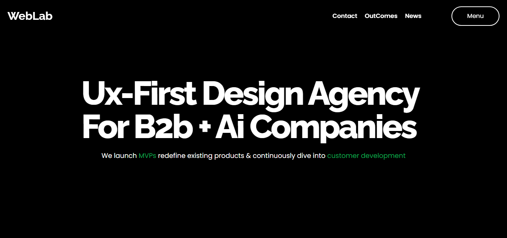

# WebLab 🚀

**WebLab** is a modern and visually appealing animated agency website clone, built using **React**, **Tailwind CSS**, and powerful animation libraries like **GSAP** and **Framer Motion**. Its is fully responsive. It delivers a dynamic landing page experience with smooth transitions and micro-interactions — all powered by cutting-edge frontend technologies.

🔗 **Live Preview:** [web-lab-eight.vercel.app](https://web-lab-eight.vercel.app/)



---

## 🧰 Tech Stack

- ⚛️ React (via Vite)
- 🎨 Tailwind CSS
- 🎞️ GSAP (GreenSock Animation Platform)
- 🌀 Framer Motion
- ⚡ Vite

---

## 🚀 Getting Started

Clone the repo and install dependencies:

```bash
git clone https://github.com/Sannan144/weblab.git
cd weblab
npm install
npm run dev
